# usd Hackertage 2018 - Challenge

In der diesjährigen (2018) Challenge galt es, Tokens in dem Format `usd{[a-z0-9]{32}}` in einem Unity Game zu finden. Mindestens eines musste gefunden werden, um sich für eine Anmeldung an den [Hackertagen](https://www.usd.de/usd-hackertage/) 2018 qualifizieren zu können - maximal 6 gab es zu holen.

Dies war meine erste Teilnahme an einer Challenge von [usd](https://www.usd.de/). Der folgende Aufschrieb dient hauptsächlich der persönlichen Archivierung.  

Zum nachträglichen Nachvollziehen der Lösung kann hier die Challenge heruntergeladen werden: [Awareness.zip](./Awareness.zip)

## Token \#1 - app.info
Das erste Token "versteckt" sich in der `app.info` Datei:

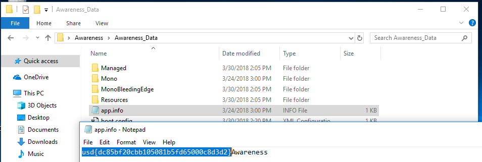

Dasselbe Token ließe sich alternativ auch unter `C:\Users\User\AppData\LocalLow` finden:

 

## Token \#2 - Asset
Stupides Suchen nach Strings mit einem Text- bzw. Hex-Editor in den Ressourcen-Dateien des Spiels brachte (natürlich) keine weiteren Erkenntnisse.

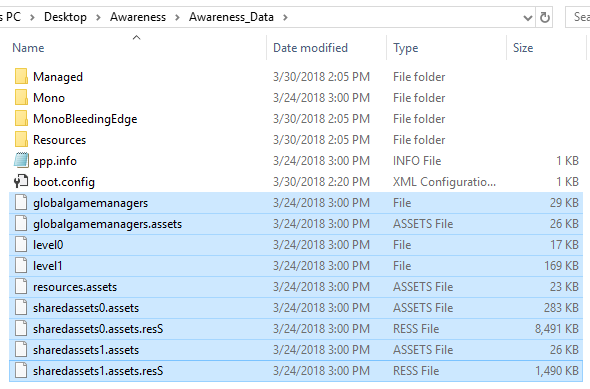

Auf der Suche nach Software, die in der Lage ist Unity-Assets zu betrachten, bin ich auf [DevXUnity-Unpacker Magic Tools](http://devxdevelopment.com/UnityUnpacker) gestoßen. Gibt eine kostenlose Demoversion - top. 
Fix runtergeladen und den Ordner `Awareness_Data` damit geöffnet.  

Unter `Shared-Assets` findet sich nun ein Bild mit dem Namen `token`:

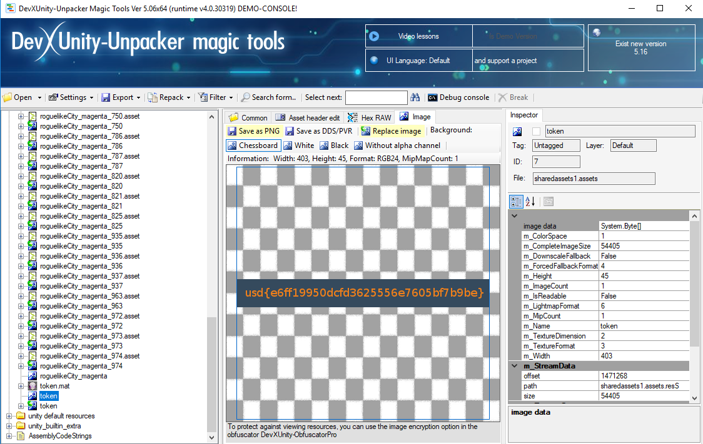

## Zwischenschritt
Der Unity-Unpacker kann zwar auch den Quellcode des Spiels dekompilieren, aber nicht editieren oder gar debuggen. Nach kurzer Recherche habe ich dann das Tool [dnSpy](https://github.com/0xd4d/dnSpy) entdeckt. Kann dekompilieren, kann Code in .NET Assemblies editieren, kann .NET Binaries debuggen... Oh und es gibt sogar eine [Anleitung](https://github.com/0xd4d/dnSpy/wiki/Debugging-Unity-Games) wie man Unity Games debuggen kann!  

In meinem Fall musste ich tatsächlich der *[Turning a release build into a debug build](https://github.com/0xd4d/dnSpy/wiki/Debugging-Unity-Games#turning-a-release-build-into-a-debug-build)*-Anleitung folgen, bis ich mich erfolgreich an einen laufenden `Awareness.exe`-Prozess anhängen konnte.  

Besonders interessant für uns sind die Assemblies `Awareness_Data/Managed/Api.dll` und `Awareness_Data/Managed/Assembly-CSharp.dll` - scheinbar ist letztere das Kompilat der Unity C\#-Skripte des Entwicklers.

## Token \#3 - License Key
Beim Starten des Spiels ist der Menüpunkt "*New Game*" ausgegraut, wir können lediglich "*Enter License*" oder "*Exit*" wählen.

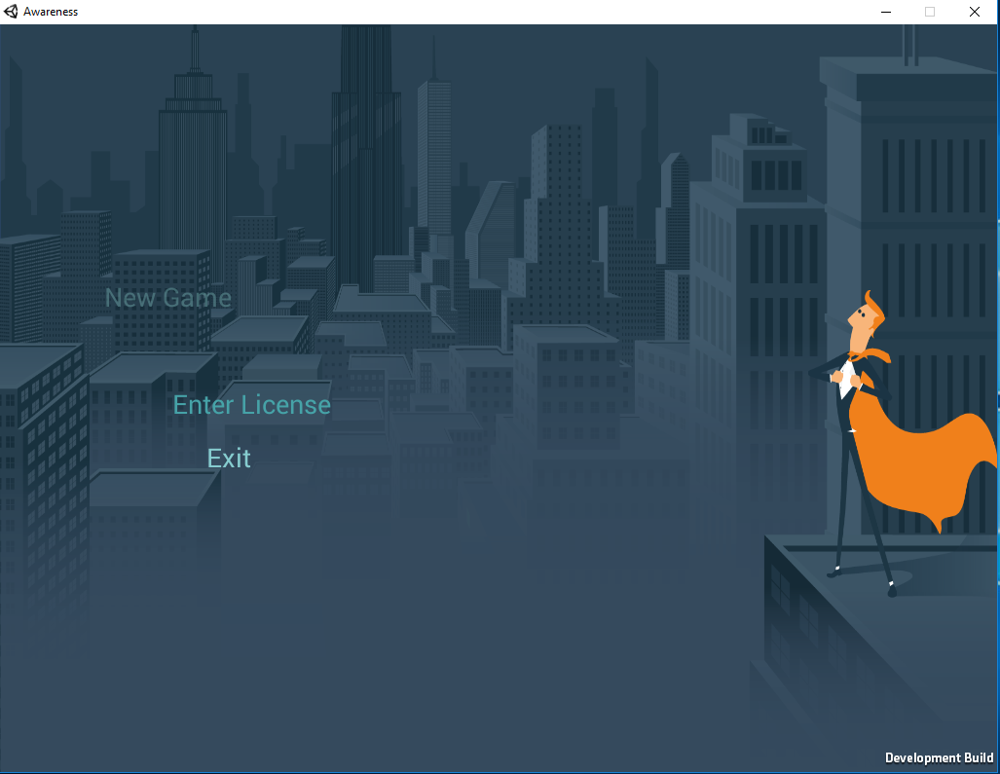

Wir durchstöbern den Quellcode und stoßen in `Assembly-CSharp.dll` auf die Klasse `RestrictedButton`. Dort wird in der Methode `Check()` festgelegt, ob der Button "aktiv" bzw. "interactable" ist. Wir setzen einen Breakpoint an genau dieser Stelle, wählen "*Enter License*" im Menü und geben eine beliebige Zeichenkette ein. Der Breakpoint wird getriggert und wir sehen den Wert, mit dem unsere Eingabe verglichen wird:

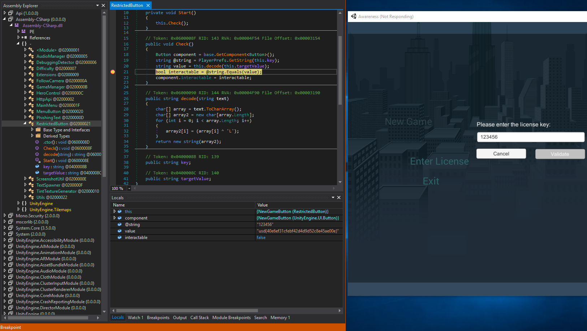

Gibt man das Token dann als Lizenz ein, wird der Menüpunkt "*New Game*" freigeschaltet.

## Token \#4 - Highscore
In der Klasse `HttpApi` setzen wir einen Breakpoint in der `Start()` Methode und wählen im Menü "*New Game*". Der Breakpoint wird getriggert und wir können die Klassenfelder `endpoint` und `key` auslesen.

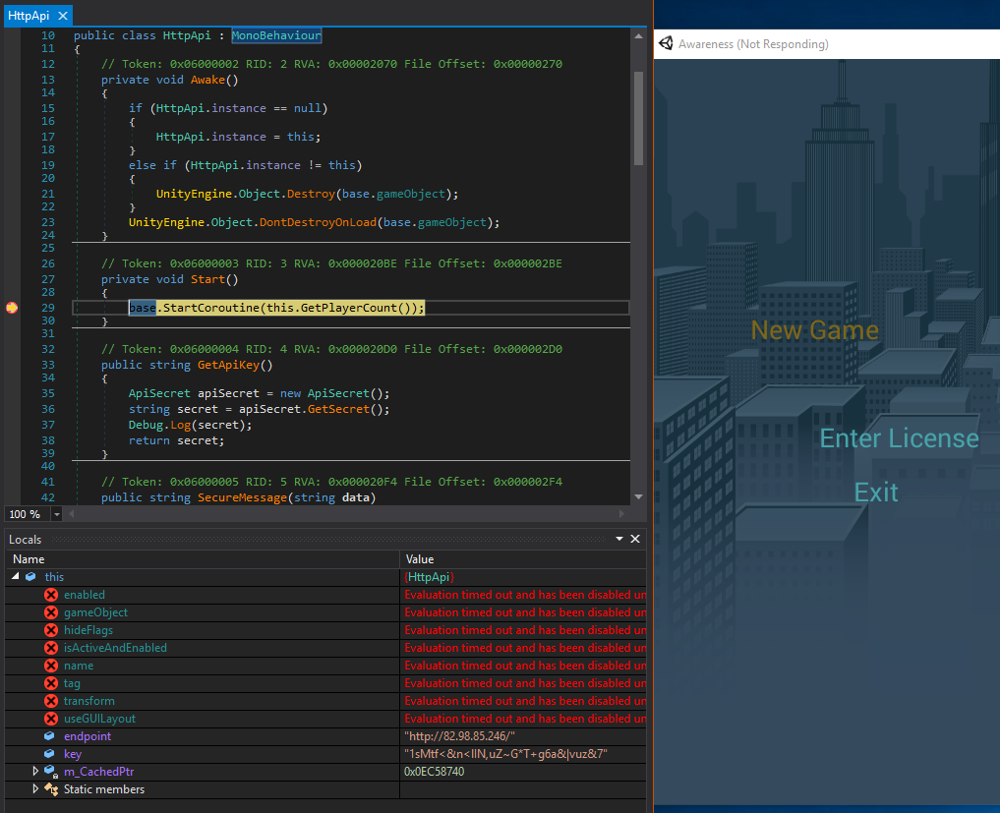

Wir entnehmen den restlichen Methoden der Klasse, dass es die API Endpoints `/players` und `/highscore` zu geben scheint. Ein Aufruf von `/players` gibt einen einfachen Integer zurück - angeblich die Anzahl der Spieler.  

Wesentlich interessanter sind da die Methoden `PostHighScore` und `SecureMessage`:

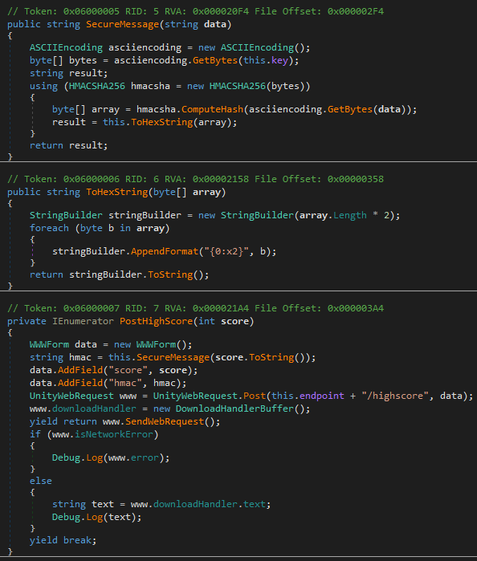

Kurz: Um einen Highscore einstellen zu können, müssen wir den entsprechenden Score zusammen mit einem HMAC bestehend aus dem Score als Nachricht und dem zuvor identifizierten API key als Secret and den `/highscore` Endpoint posten. Wie deutlich im Code zu sehen muss SHA256 zum hashen verwendet werden.

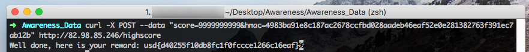

Für die schnelle Erzeugung des HMAC habe ich [diese](https://www.freeformatter.com/hmac-generator.html) Seite verwendet. 

## Token \#5 - HTTP API Secret
Wir schauen uns die Klasse `ApiSecret` aus dem `Api.dll` Assembly an.

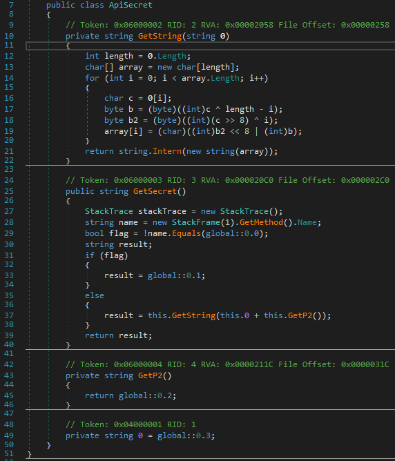

Ok - `GetString` sieht schonmal gruselig aus. Aber wir sehen, dass scheinbar je nachdem von welcher Methode aus `GetSecret` aufgerufen wird, wir ein anderes Secret bekommen.  

Seltsamerweise wird `GetSecret` aber nie getriggert, kein Breakpoint greift. Wir behelfen uns, indem wir die Methode manuell von einer Stelle aus aufrufen, von der wir wissen, dass sie garantiert beim Starten des Spiels aufgerufen wird: `HttpApi.Start()`:

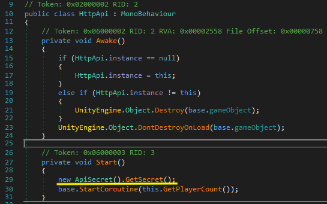

Nun setzen wir einen Breakpoint in `ApiSecret`, Zeile `29`. Wir wählen wieder "*New Game*" und unser Breakpoint wird getriggert. Wir überspringen diese Zeile und editieren dann die Variable `flag`, sodass diese nun `false` statt `true` beinhaltet. Jetzt steppen wir im Debugger bis zum Ende der Methode und erhalten unser Token.

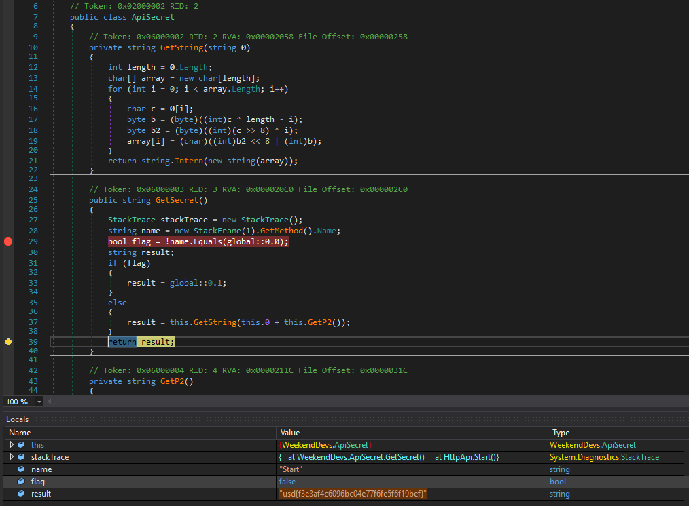

## Token \#6 - Screenshot
Beim Betrachten der Klasse `ScreenshotUtil` fällt uns auf, dass Irgendwas komisches mit dem Bild gemacht wird, bevor es gespeichert wird:

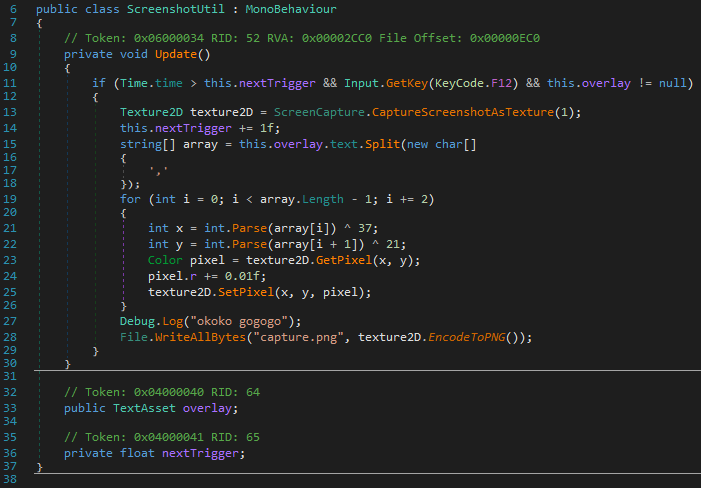

Ein Overlay wird über das Bild gelegt - bei den betroffenen Pixeln wird der Red-Channel um `0.01` inkrementiert - für das bloße Auge eine nicht zu erkennende Änderung.

Ich habe viel zu viel Zeit damit verbracht, irgendwie nachzuvollziehen, was genau da passiert und wie wohl das Resultat aussehen könnte, bis ic darauf kam, das Inkrement einfach auf eine höhere Zahl zu erhöhen, z.B. `1.0`.  

Das war dann auch schon die Lösung. Code editiert, kompiliert, Assembly gespeichert, Spiel gestartet, mit `F12` einen Screenshot erstellt, die neue Datei `capture.png` im Hauptverzeichnis des Spiels geöffnet...  

Am linken unteren Bildschirmrand war ein vertikal gespiegeltes Token. Also Bild um 180° gedreht und horizontal gespiegelt:

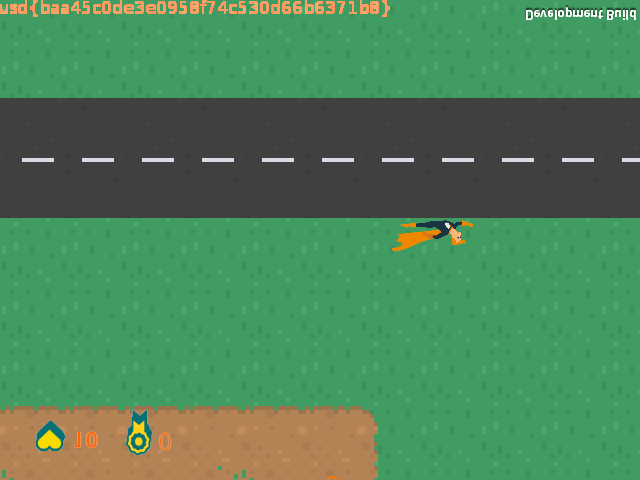
