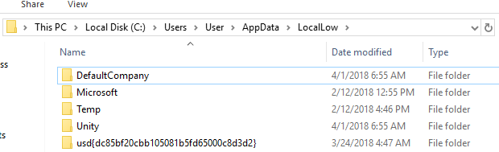

# usd Hackertage 2018 - Challenge

In der diesjährigen (2018) Challenge galt es, Tokens in dem Format `usd{[a-z0-9]{32}}` in einem Unity Game zu finden.

Dies war meine erste Teilnahme an einer Challenge von [usd](https://www.usd.de/). Der folgende Aufschrieb dient hauptsächlich der persönlichen Archivierung.  

Zum Nachvollziehen der Lösung kann hier die Challenge heruntergeladen werden: [Awareness.zip](./Awareness.zip)

## Token \#1 - app.info
Das erste Token "versteckt" sich in der `app.info` Datei:

Dasselbe Token ließe sich alternativ auch unter `C:\Users\User\AppData\LocalLow` finden:

 

## Token \#2 - Asset
Stupides Suchen nach Strings mit einem Text- bzw. Hex-Editor in den Ressourcen-Dateien des Spiels brachte (natürlich) keine weiteren Erkenntnisse.

Auf der Suche nach Software, die in der Lage ist Unity-Assets zu betrachten, bin ich auf [DevXUnity-Unpacker Magic Tools](http://devxdevelopment.com/UnityUnpacker) gestoßen. Gibt eine kostenlose Demoversion - top. 
Fix runtergeladen und den Ordner `Awareness_Data` damit geöffnet.  

Unter `Shared-Assets` findet sich nun ein Bild mit dem Namen `token`:

## Zwischenschritt
Der Unity-Unpacker kann zwar auch den Quellcode des Spiels dekompilieren, aber nicht editieren oder gar debuggen. Nach kurzer Recherche habe ich dann das Tool [dnSpy](https://github.com/0xd4d/dnSpy) entdeckt. Kann dekompilieren, kann Code in .NET Assemblies editieren, kann .NET Binaries debuggen... Oh und es gibt sogar eine [Anleitung](https://github.com/0xd4d/dnSpy/wiki/Debugging-Unity-Games) wie man Unity Games debuggen kann!  

In meinem Fall musste ich tatsächlich der *[Turning a release build into a debug build](https://github.com/0xd4d/dnSpy/wiki/Debugging-Unity-Games#turning-a-release-build-into-a-debug-build)*-Anleitung folgen, bis ich mich erfolgreich an einen laufenden `Awareness.exe`-Prozess anhängen konnte.  

Besonders interessant für uns sind die Assemblies `Awareness_Data/Managed/Api.dll` und `Awareness_Data/Managed/Assembly-CSharp.dll` - scheinbar ist letztere das Kompilat der Unity C\#-Skripte des Entwicklers.

## Token \#3 - License Key
Beim Starten des Spiels ist der Menüpunkt "*New Game*" ausgegraut, wir können lediglich "*Enter License*" oder "*Exit*" wählen.

Wir durchstöbern den Quellcode und stoßen in `Assembly-CSharp.dll` auf die Klasse `RestrictedButton`. Dort wird in der Methode `Check()` festgelegt, ob der Button "aktiv" bzw. "interactable" ist. Wir setzen einen Breakpoint an genau dieser Stelle, wählen "*Enter License*" im Menü und geben eine beliebige Zeichenkette ein. Der Breakpoint wird getriggert und wir sehen den Wert, mit dem unsere Eingabe verglichen wird:

Gibt man das Token dann als Lizenz ein, wird der Menüpunkt "*New Game*" freigeschaltet.

## Token \#4 - HTTP API Secret

## Token \#5 - Highscore

## Token \#6 - Screenshot
